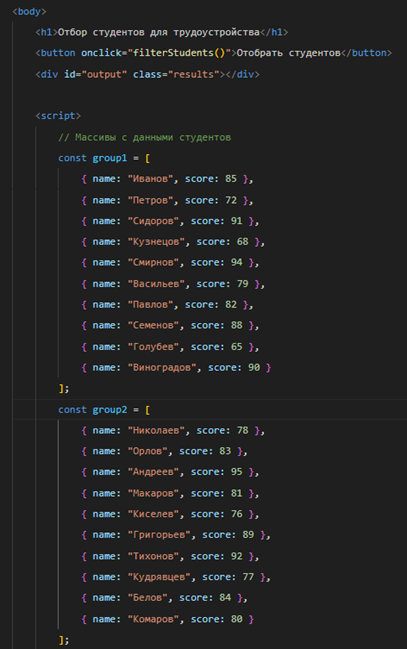
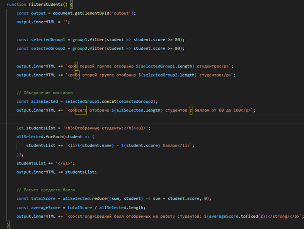
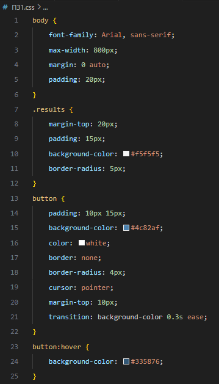
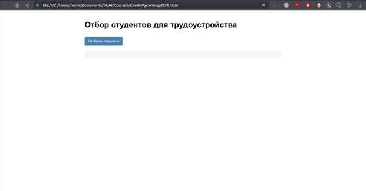
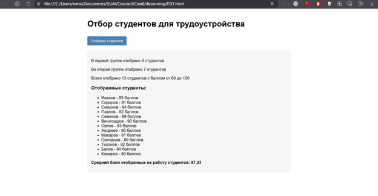
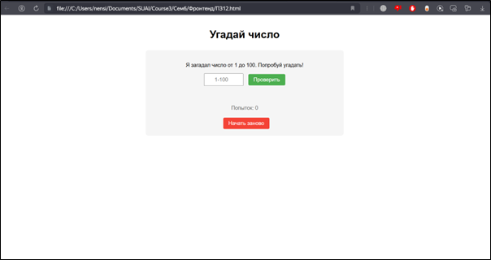
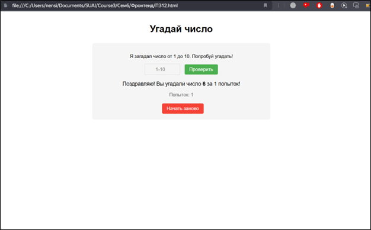

# Practical-work-with-DOM-cookie-localStorage-and-sessionStorage-in-JS
Formation of practical skills in working with DOM elements, with technologies that allow you to control the display and positioning of elements in a web document, as well as the formation of practical skills in working with cookies, local storage, session storage in JavaScript.

🎲 Отбор студентов и игра "Угадай число" 
Этот проект включает в себя две части: отбор студентов для трудоустройства и игру "Угадай число". Обе части демонстрируют работу с DOM, управление отображением и позиционированием элементов, а также использование sessionStorage в JavaScript.

🎯 Цель работы 
Формирование практических навыков работы с элементами DOM и технологиями, позволяющими управлять отображением и позиционированием элементов в веб-документе. Также проект направлен на формирование навыков работы с cookie, localStorage и sessionStorage в JavaScript.

📋 Задание 
Часть 1: Отбор студентов для трудоустройства
Задание состоит в отборе лучших студентов из двух групп, прошедших тестирование по некоторой дисциплине, для рассмотрения вопроса их дальнейшего трудоустройства. Для этого создаются два массива, каждый из которых содержит объекты с фамилиями студентов и их результатами тестирования в баллах.

🎓 Функциональность:
Отбор студентов, набравших не менее 80 баллов.
Вывод сообщения о количестве отобранных студентов в каждой группе.
Формирование общего массива из отобранных студентов и вывод сообщения о количестве студентов, набравших от 80 до 100 баллов.
Отображение фамилий отобранных студентов и их баллов.
Расчет и вывод среднего балла отобранных студентов.

📷 Скриншоты процесса:

Рисунок 1 – Создание массивов с данными студентов

Рисунок 2 – Создание функции фильтрации

Рисунок 3 – CSS-стилизация веб-страницы

Рисунок 4 – Начальный экран сайта

Рисунок 5 – Результаты после нажатия кнопки

🎮 Часть 2: Игра "Угадай число"
Создание простой игры "Угадай число", где компьютер загадывает случайное число от 1 до 10, а игрок должен его угадать. При загрузке страницы генерируется и сохраняется в sessionStorage загаданное число, чтобы при обновлении страницы игра не сбрасывалась.

📷 Скриншоты игры:

Рисунок 6 – Начало игры

Рисунок 7 – Процесс угадывания

🎓 Функциональность:
Пользователь вводит свои догадки в текстовое поле и получает подсказки.
Игра выводит поздравление с количеством затраченных попыток при правильном ответе.
Кнопка "Начать заново" позволяет сбросить текущую игру и загадать новое число.
Все данные (загаданное число и счетчик попыток) хранятся в sessionStorage браузера и автоматически удаляются при закрытии вкладки.

# Вывод 
В ходе выполнения практического задания были успешно освоены ключевые аспекты работы с JavaScript в контексте frontend-разработки. В первой части работы реализован алгоритм обработки данных студентов с использованием современных методов работы с массивами (filter, concat, reduce), что позволило эффективно решить задачу фильтрации и анализа результатов тестирования. Разработанный интерфейс демонстрирует принципы взаимодействия JavaScript с DOM-элементами, обеспечивая интуитивно понятное отображение результатов отбора.

Во второй части задания создана интерактивная игра "Угадай число", которая наглядно иллюстрирует работу с sessionStorage для сохранения состояния приложения между перезагрузками страницы. Особое внимание уделено обработке пользовательского ввода и реализации логики игры с предоставлением обратной связи. Интерфейс игры разработан с учетом принципов адаптивного дизайна и UX-оптимизации.

Практическая значимость выполненной работы заключается в освоении технологий клиентского хранения данных и манипуляций с DOM, которые являются фундаментальными для современных веб-приложений. Реализованные решения демонстрируют понимание асинхронной природы JavaScript и принципов построения интерактивных интерфейсов.
